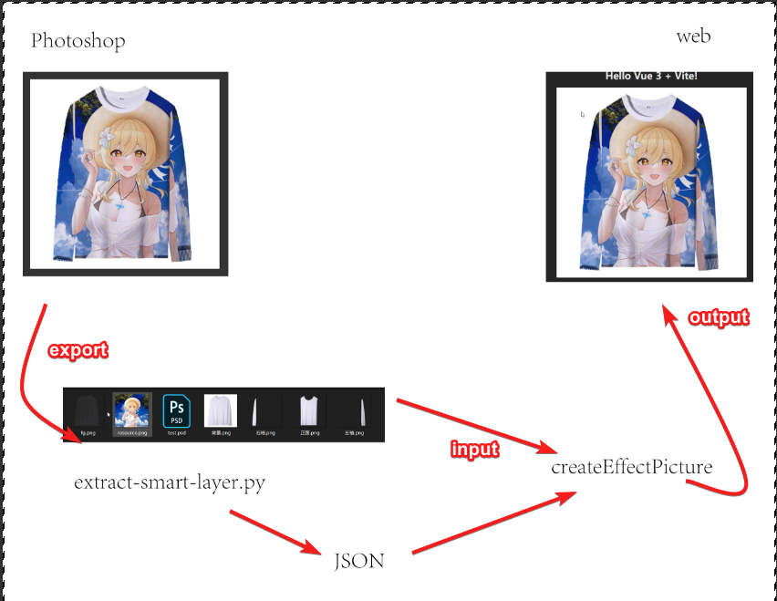

# vue-effect-picture

`vue-effect-picture`是一个基于Three.js和GLFX的效果图合成组件，虽然使用了Vue 3框架，但组件本身并不依赖Vue，理论可以在任何UI框架中使用。

本项目目前没有发布到npm，请直接下载源码使用。

项目中有 `effectPicture` 目录和 `effectPictureWorker` 目录， 对外接口是一样的，`effectPictureWorker`在变形部分使用Web Worker。

## 效果预览



## 安装依赖

```bash
npm install  three glfx
```

## 快速上手

```js
import { createEffectPicture } from './effectPicture/effectPicture';
// import { createEffectPicture } from "./effectPictureWorker/effectPicture";

// 初始化
const effectPicture = createEffectPicture({
    // el: "#my-canvas",
    name: "Preview1",
    width: 512,
    height: 512,
    components: [...]
});

// 设置Canvas元素
const canvas = document.getElementById('my-canvas') as HTMLCanvasElement;
effectPicture.setElement(canvas);

// 直接合成显示白板图
await effectPicture.combine();
effectPicture.showResult();

// 加载并处理图像
const img = new Image();
img.src = "input.png";

img.onload = async () => {
  // 渲染单个组件
  await effectPicture.renderComponent("component1", img);
//   await effectPicture.renderComponent("component1"); // 如果不传入图片，则渲染默认白板
  
  // 批量渲染多个组件
  await effectPicture.renderAll([
    ['component2', img],
    ['component3', img]
  ]);
  
  // 最终合成
  await effectPicture.combine();
  effectPicture.showResult();
  
  // 获取结果数据
  const resultData = effectPicture.getResultDataURL();
};
```

## 后续

- [ ] 完善文档
- [ ] 开发对应VUE组件
- [ ] 发布到npm

## 注意

在public目录下有一些图片素材，来自网络，仅供参考，请谨慎使用。

## 许可证

MIT © 2025 田家二少
